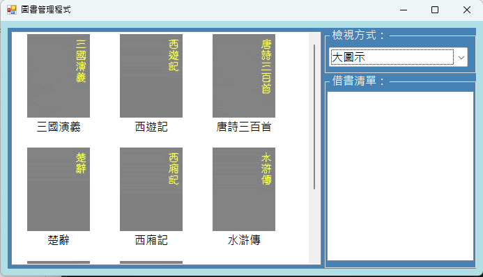

# 圖書管理程式
## 專案簡介
本專案開發了一款具備直覺操作介面與嚴謹借閱邏輯的圖書管理程式。本系統不僅支援多元的書籍清單選取與顯示方式，還內建了「安全借閱確認機制」與「雙欄位連動佈局」，透過滑鼠雙擊觸發確認彈窗，確保使用者在瀏覽、選取與借閱書籍時，擁有流暢、直覺且穩定的操作體驗。

## 使用者畫面

## 執行說明書

### 操作流程說明
請依序執行以下步驟進行圖書管理與借閱操作：
1. **瀏覽與選取書籍**：在介面左方的「書籍顯示區」，透過清單選取方式瀏覽館藏書籍，使用者可自由切換不同的顯示與排序方式。
2. **觸發借閱指令**：在左方清單中，滑鼠「點兩下（雙擊）」欲借閱的書籍項目。
3. **確認借閱意圖**：系統會自動彈出確認視窗，詢問「確定要借這本書嗎？」。
4. **檢視借閱結果**：點選確認後，該書籍會成功加入借閱清單，並即時顯示於介面右下角的「已借閱書籍區」。

### 功能按鈕與互動操作
* **清單選取與顯示切換**：提供不同的書籍清單檢視模式，方便使用者快速篩選與選取書籍。
* **左方書籍顯示清單**：動態載入並顯示目前館藏的所有書籍資訊，支援點擊選取。
* **滑鼠雙擊 (Double Click)**：對準書籍項目點兩下，做為啟動借閱流程的快捷核心操作。
* **右下角已借閱清單**：即時集中顯示目前使用者已成功借閱的書籍紀錄。
